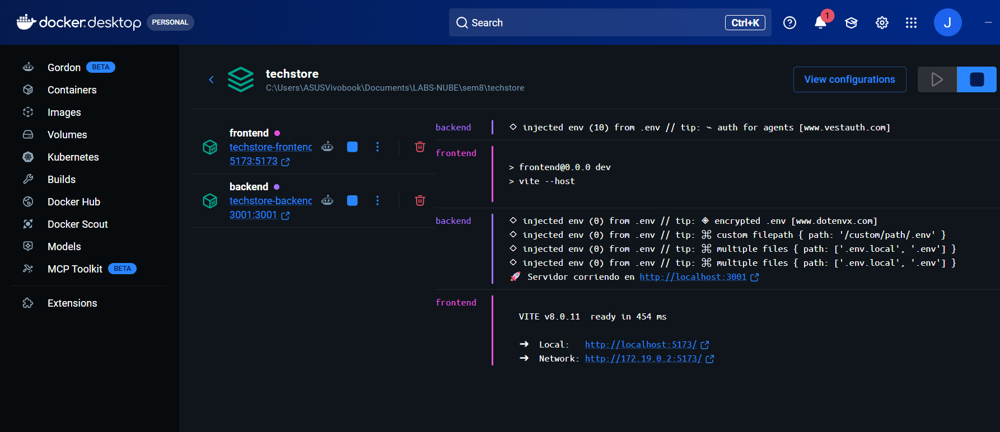

backend 

◇ injected env (10) from .env // tip: ⌁ auth for agents [www.vestauth.com]
frontend

> frontend@0.0.0 dev

> vite --host

backend 

◇ injected env (0) from .env // tip: ◈ encrypted .env [www.dotenvx.com]

◇ injected env (0) from .env // tip: ⌘ custom filepath { path: '/custom/path/.env' }

◇ injected env (0) from .env // tip: ⌘ multiple files { path: ['.env.local', '.env'] }

◇ injected env (0) from .env // tip: ⌘ multiple files { path: ['.env.local', '.env'] }

🚀 Servidor corriendo en http://localhost:3001
frontend

  VITE v8.0.11  ready in 454 ms

  ➜  Local:   http://localhost:5173/

  ➜  Network: http://172.19.0.2:5173/
